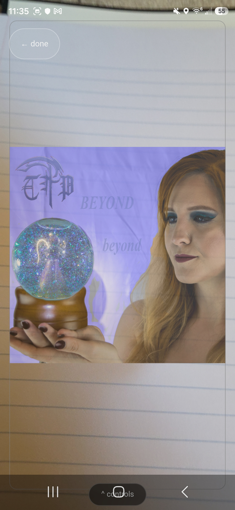
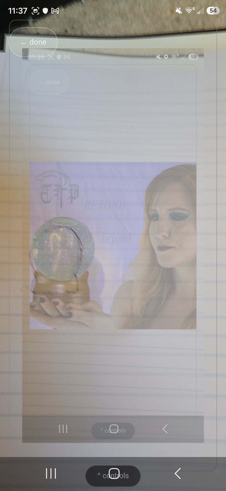
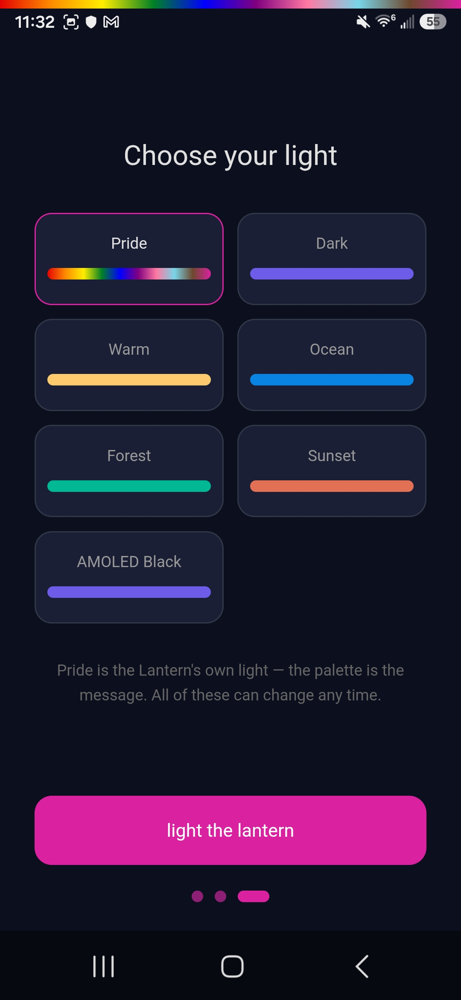
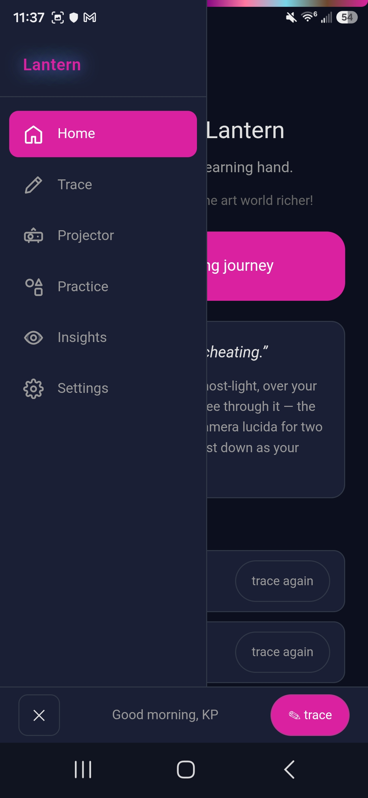
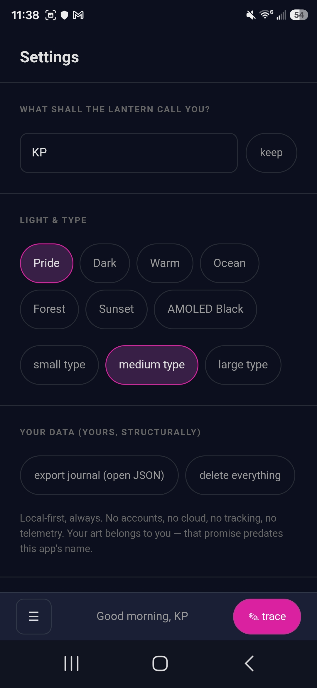
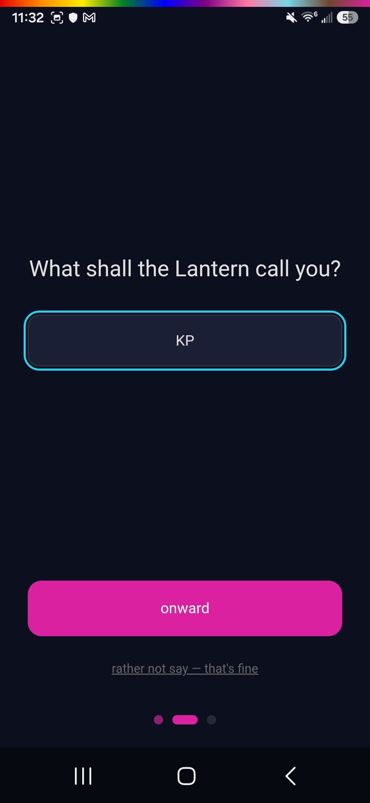

# 🏮 Resonance Lantern

*The Lantern Room of the AudHDities Sanctuary — a steady light for a learning hand.*

[](LICENSE)
[]()
[]()
[](https://audhdities.com/apps/privacy)

A digital *camera lucida*: pick a reference image and it floats — ghost-light,
opacity to your comfort — over the live camera pointed at your real paper.
Trace what you see through it. The way artists have learned for two hundred
years, rebuilt as a sovereign app.

> **“Tracing is learning, not cheating.”**

Born from **CanvasGuide** — built by the Quantum Weaver for **TJ Darling
(@TJDPoetry)** and her creative community; a gift inside the family, becoming
a gift beyond it. Her voice, her pride palette, and her platforms are
preserved verbatim in this rebuild.

## Screenshots

<p align="center">
  
  
  
  
  
  
</p>

## What lives here

- **Trace** — the heart. Live camera + ghost overlay; opacity as a *comfort*
  control ("turn it down as you grow"), with first-pass / refining / checking
  presets; independent image and view zoom; one-tap control collapse so
  nothing ever obstructs the viewfinder; canvas-composite **capture** of your
  finished work. Paper mode when no camera is present.
- **Practice** — starter shapes with honest curves, categories, difficulty
  dots, and a 🎲 — invitation, not curriculum. No streaks, no scores.
- **Insights** — a practice journal, shown gently: sessions, minutes with
  pencil in hand, most-practiced. Presence of practice, never pressure.
- **Projector** — the current reference or practice outline full-screen on
  pure black, for tracing at a real easel: zoom, pan, rotate, invert, a
  brightness dim, keep-awake while projecting. Jessica's own first wish for
  the app, built 2026-07-12 (the retired checklist's Phase 8 — git history before 2026-08-25; the realm's open items and plans live in the base — `python C:/_superposition/resonance-progenatrix/progenatrix.py recall --realm resonance-lantern`).
- **The voice** — CanvasGuide's original encouragements, tips, and welcomes,
  surfacing at every threshold. *"Every artist was once a beginner brave
  enough to start."*
- **Pride, first-class** — the progressive pride palette is the default
  theme, because "you belong here" deserves to be rendered in hex codes.
- **Sovereignty** — local-first, no accounts, no tracking; export your
  journal as open JSON; a purge that truly purges. Your art belongs to you.

## THE STORY

*This section required by the [Story Block Standard](https://github.com/Quantum-Weaver/resonance-standards).*

Resonance Lantern is a rebuild of **CanvasGuide** — a four-day side project
the Weaver threw together as a break from building the Sanctuary itself, a
gift for TJ Darling (@TJDPoetry) and her creative community. Named by the
Council, 2026-07-03, it completes the original triad: Echoes looks back,
Compass looks around, Lantern looks forward. Rebuilt on the family's own
stack rather than kept in Expo, gated by one honest camera spike that closed
on real devices, 2026-07-18.

📖 [Full Story Block](docs/STORY-BLOCK.md)

## Camera status (honest)

- **Desktop: works now** — `getUserMedia` webcam preview + capture.
- **Android: live** — the spike passed on real devices 2026-07-18
  (`docs/FRAMEWORK-DECISION.md`), and the v0.2.0 build carries the
  camera on-device — the screenshots above are the Weaver's own S25
  captures of it tracing. The store ascent is underway at KP's own
  call (the pack: `docs/PLAY-TRACK.md`) — the Console reads it in
  Closed testing (Console, Aug 24, 2026; KP's paste 09-01).

## Lineage & stack

Built on a clone of **Resonance Echoes** v1.1.0 (Echoes unaltered) — the same
descent as Resonance Hearth. Tauri v2 · SvelteKit · Svelte 5 · Tailwind 4 ·
SQLite (local). Ancestor preserved untouched in the excavator's landfill;
concept analysis in `resonance-chamber/constellation/weaver/mimirs-well/design-lineage/catchall-concepts-2026-07/canvasguide-concepts.md` (re-homed at the 2026-07-18 dispersal).

```bash
npm install
npm run tauri dev     # desktop (first run compiles Rust)
```

## License

MIT under the **Resonance License** promise — see [PHILOSOPHY.md](PHILOSOPHY.md).
No exploitation, no extraction, no exclusion. Sovereignty of data.

---

*Echoes looks back. Compass looks around. **Lantern looks forward.** Loom
connects all. Hearth gathers all.*

*The lamp was lit before anyone arrived.* 🎻🏮
